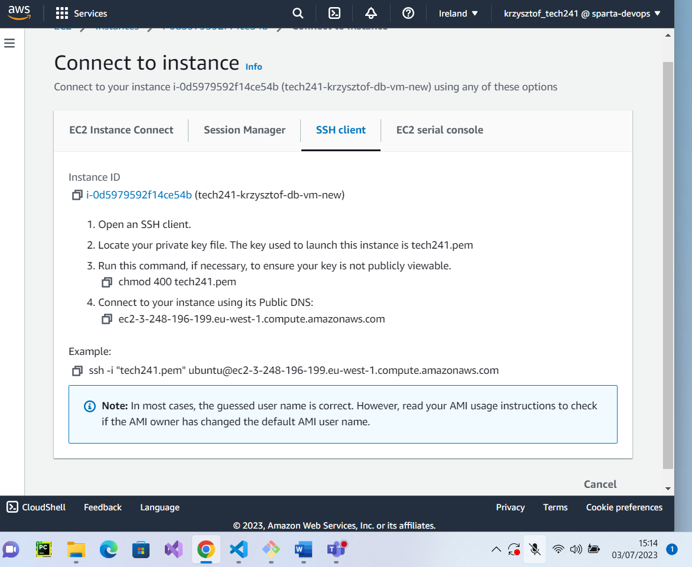
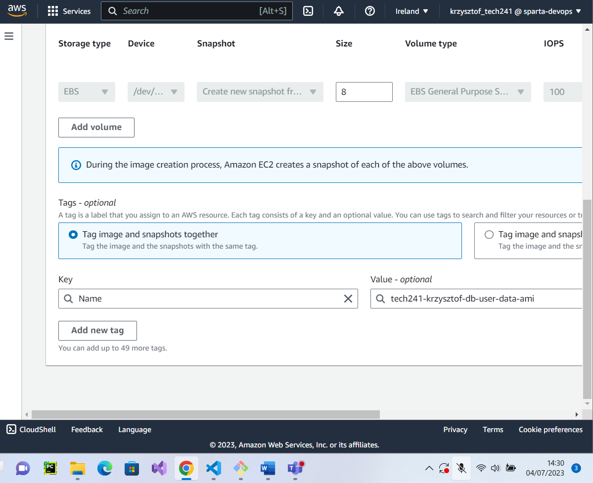
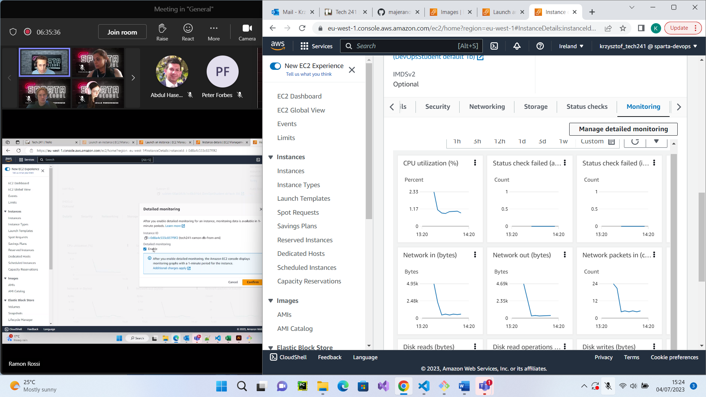
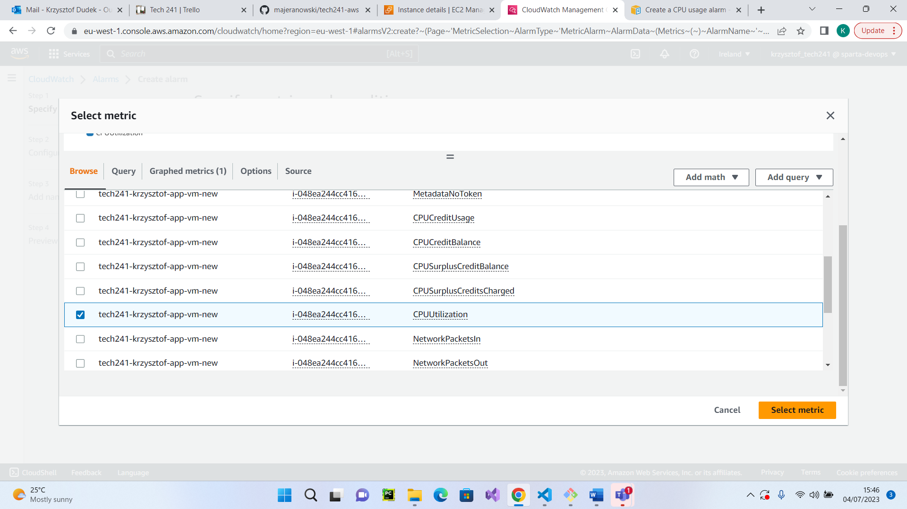
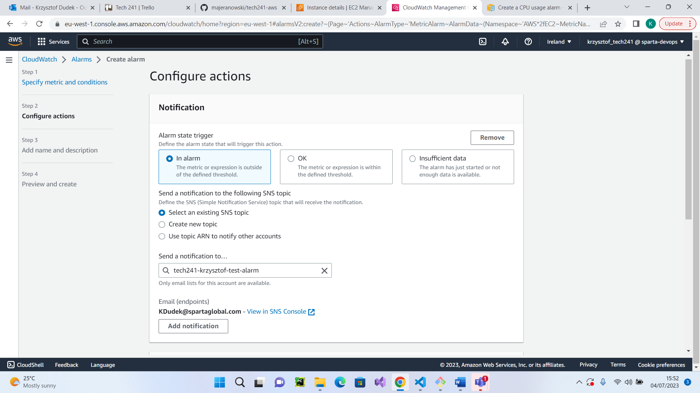
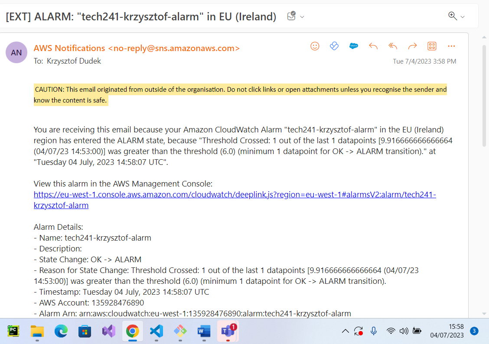

# AWS (Amazon Web Services)

## Differences between Azure and AWS:
---

* Resource groups 
  - in Azure, everything needs to go in a Resource group
  - in AWS, there is no need for Resource Groups. They exist but not necessery.

* Public IP addresses 
  - in Azure, by default, uses static
  - in AWS, by default, use dynamic (changes it every time your VM restarts)

* Terminology
  - Launch in AWS = Create in Azure
  - Instance in AWS = VM in Azure


# Starting EC2 instance:

* **At the beginning, after logging in to AWS portal with your credentials make sure to change the region for EUROPE (Ireland).**


* **EC2 -> Instances -> Launch instances - over here we can launch (create) instances (VMs)**
  

  
* **search for image : 18.04 LTS 1e9 (community AMIs) - this is the version of the Ubuntu we are using for test purposes**


* **t2.micro for Instance type**
* **Network security groups (SSH, HTTP, 3000) -for Sparta app or (SSH, 27017) for db.**


<mark>**We can also save Security group rules and reused them later**


* **After launching an instance we can stop it or terminate it simply from the AWS EC2 dashboard**


## In case of setup SSH key in AWS:
---

* type 'key pair' -> create key pair.
* RSA key pair type
* Key file format .pem


## Connect to SSH:
---

`ssh -i "~/.ssh/tech241.pem" ubuntu@ec2-54-73-7-211.eu-west-1.compute.amazonaws.com`

<mark>**REMEMBER**</mark> IP is dynamic so you won't be able to log back in with the same IP in the command



# Running sparta app and db scripts on AWS instances:

After sucessfully logging in to instances to run our scripts it is simply copying and pasting the same code we used in Azure.

## App script:
---

```bash
#!/bin/bash


# update
sudo apt update -y

# upgrade
sudo apt upgrade -y
# install nginx
sudo apt install nginx -y

# enable nginx
sudo systemctl enable nginx
# installing sed
sudo apt install sed -y
# setup nginx as a reverse proxy
sudo sed -i 's@try_files .*;@proxy_pass http://localhost:3000;@' /etc/nginx/sites-available/default
# restart nginx again
sudo systemctl restart nginx
# get from url needed version of node
curl -sL https://deb.nodesource.com/setup_12.x | sudo -E bash -
# install nodejs
sudo apt install -y nodejs
#installing pm2 that helps run apps in the background
sudo npm install pm2 -g
# getting app folder to the VM
git clone https://github.com/majeranowski/tech241-sparta-app.git repo
#getting inside app folder
cd repo/app
#Creating DB_HOST env variable
export DB_HOST=mongodb://20.162.216.138:27017/posts
# installing the app
npm install
# starting the app
pm2 start app.js    

```

## **Notes**: 

* in the command for creating DB_HOST env variable we need to remember that IP for our DB instance will be dynamic. We have to specify the correct IP address before running the script.
  
  ---

## DB script

```bash
#!/bin/bash

# Update and upgrade the system
sudo apt update -y
sudo apt upgrade -y

#to download key for the right version (from mongo db website)
wget -qO - https://www.mongodb.org/static/pgp/server-3.2.asc | sudo apt-key add -

# source list
echo "deb http://repo.mongodb.org/apt/ubuntu xenial/mongodb-org/3.2 multiverse" | sudo tee /etc/apt/sources.list.d/mongodb-org-3.2.list

# update again
sudo apt update -y

# install mongo db
sudo apt-get install -y mongodb-org=3.2.20 mongodb-org-server=3.2.20 mongodb-org-shell=3.2.20 mongodb-org-mongos=3.2.20 mongodb-org-tools=3.2.20

# Configure bindIp to 0.0.0.0
sudo sed -i 's/bindIp: 127.0.0.1/bindIp: 0.0.0.0/g' /etc/mongod.conf

# Start Mongo DB
sudo systemctl start mongod

# Enable Mongo DB
sudo systemctl enable mongod
```
--- 


**After sucessfully running both scripts everything should work like that:**


---


---

# Logging/SSHing in and running app script

## Scenario 1 as Ubuntu:

pwd

/home/ubuntu

git clone ... repo

/home/ubuntu/repo

cd repo/app

---

## Scenario 2 - get VM to run app script for us (as root user)

pwd 

/

git clone ... repo

/repo

cd repo/app

---

# AMIs

**AMI - Amazon Machine Image**

If we have VM and want to duplicate it. AMI is the image of that VM. Part of creating AMI is taking a snapshot of the disk. 
If we have an image we can make identical copy of VM.

## **Creating an AMI**

---




## **Launching an instance from AMI**


---

When we launch an instance from AMI we wo't have to specify the image of the operating system and copy of the disk will be exactly the same as from the copied instance, including user data we ran before.

## **User Data**

---

User data is a place while creating an instance where we can write some commands. User data will be executed while creating an Instance.
User data will run only once, when creating VM.

We can add it while launching an instance in 'Advance settings'


# Monitoring and alerts

First step is to enable detailed monitoring in our Instances:

* We can do in in our instance dashboard inside 'monitoring' tab


# Setting up a CPU usage alarm using the AWS Management Console
**Use these steps to use the AWS Management Console to create a CPU usage alarm.**

* To create an alarm based on CPU usage
Open the CloudWatch console at https://console.aws.amazon.com/cloudwatch/.

* In the navigation pane, choose Alarms, All Alarms.



* Choose Create alarm.

* Choose Select metric.

* In the All metrics tab, choose EC2 metrics.

* Choose a metric category (for example, Per-Instance Metrics).

 - Find the row with the instance that you want listed in the   InstanceId column and CPUUtilization in the Metric Name column. Select the check box next to this row, and choose Select metric.



* Under Specify metric and conditions, for Statistic choose Average, choose one of the predefined percentiles, or specify a custom percentile (for example, p95.45).

* Choose a period (for example, 5 minutes).

* Under Conditions, specify the following:

* For Threshold type, choose Static.

   - For Whenever CPUUtilization is, specify Greater. Under than..., specify the threshold that is to trigger the alarm to go to ALARM state if the CPU utilization exceeds this percentage. For example, 70.

   - Choose Additional configuration. For Datapoints to alarm, specify how many evaluation periods (data points) must be in the ALARM state to trigger the alarm. If the two values here match, you create an alarm that goes to ALARM state if that many consecutive periods are breaching.

   - To create an M out of N alarm, specify a lower number for the first value than you specify for the second value. For more information, see Evaluating an alarm.

  -  For Missing data treatment, choose how to have the alarm behave when some data points are missing. For more information, see Configuring how CloudWatch alarms treat missing data.

  -  If the alarm uses a percentile as the monitored statistic, a Percentiles with low samples box appears. Use it to choose whether to evaluate or ignore cases with low sample rates. If you choose ignore (maintain alarm state), the current alarm state is always maintained when the sample size is too low. For more information, see Percentile-based CloudWatch alarms and low data samples.


* Choose Next.

* Under Notification, choose In alarm and select an SNS topic to notify when the alarm is in ALARM state

    -  To have the alarm send multiple notifications for the same alarm state or for different alarm states, choose Add notification.

   - To have the alarm not send notifications, choose Remove.



* When finished, choose Next.

* Enter a name and description for the alarm. Then choose Next.


Under Preview and create, confirm that the information and conditions are what you want, then choose Create alarm.

When CPU usage reaches the specified limit we will be notify via email and status of the alrm will change to 'in alarm'




