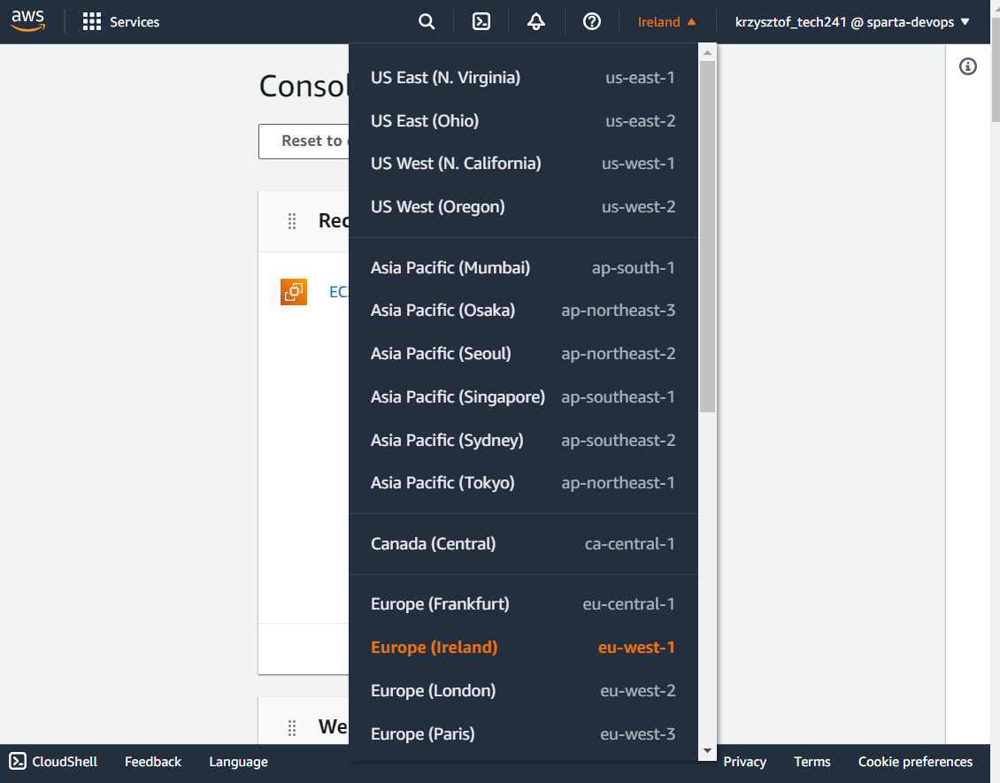
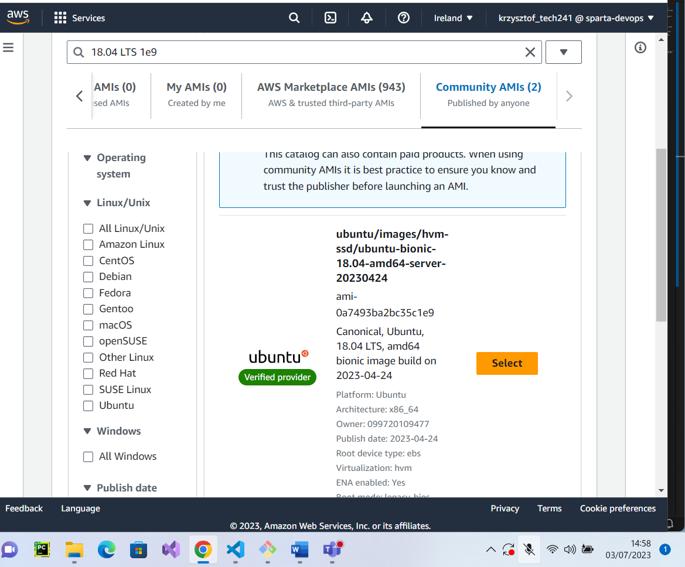
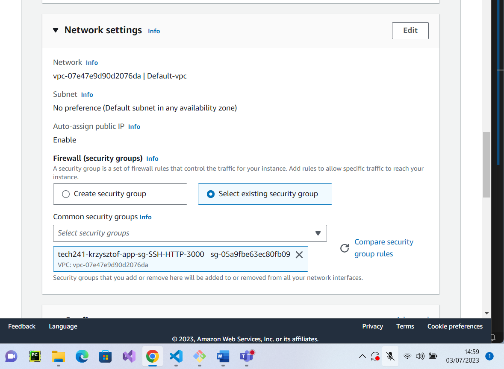
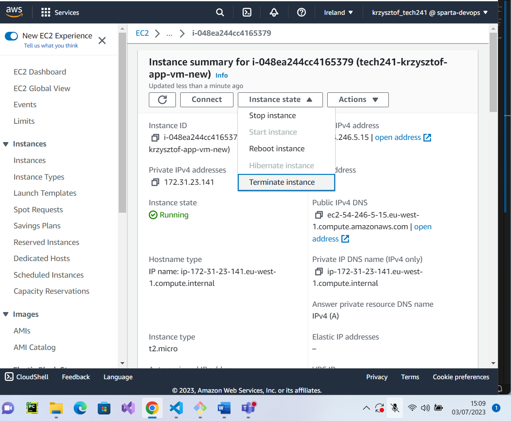
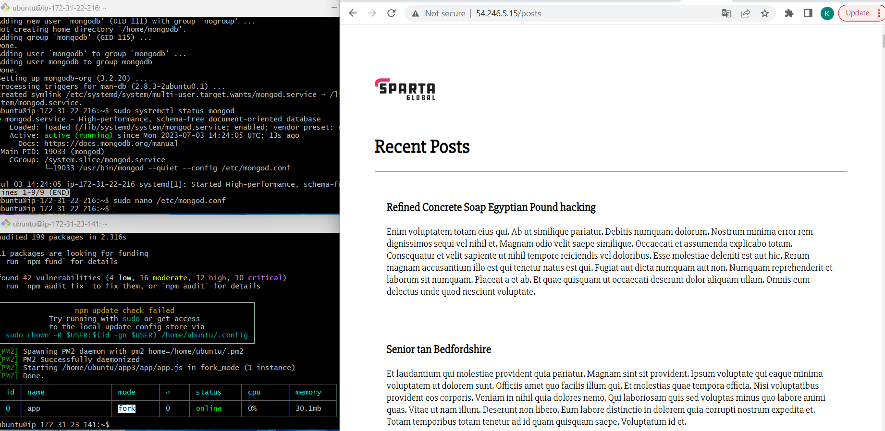

# AWS (Amazon Web Services)

## Differences between Azure and AWS:
---

* Resource groups 
  - in Azure, everything needs to go in a Resource group
  - in AWS, there is no need for Resource Groups. They exist but not necessery.

* Public IP addresses 
  - in Azure, by default, uses static
  - in AWS, by default, use dynamic (changes it every time your VM restarts)

* Terminology
  - Launch in AWS = Create in Azure
  - Instance in AWS = VM in Azure


# Starting EC2 instance:

* **At the beginning, after logging in to AWS portal with your credentials make sure to change the region for EUROPE (Ireland).**



* **EC2 -> Instances -> Launch instances - over here we can launch (create) instances (VMs)**
  

  
* **search for image : 18.04 LTS 1e9 (community AMIs) - this is the version of the Ubuntu we are using for test purposes**



* **t2.micro for Instance type**
* **Network security groups (SSH, HTTP, 3000) -for Sparta app or (SSH, 27017) for db.**


<mark>**We can also save Security group rules and reused them later**



* **After launching an instance we can stop it or terminate it simply from the AWS EC2 dashboard**



## In case of setup SSH key in AWS:
---

* type 'key pair' -> create key pair.
* RSA key pair type
* Key file format .pem


## Connect to SSH:
---

`ssh -i "~/.ssh/tech241.pem" ubuntu@ec2-54-73-7-211.eu-west-1.compute.amazonaws.com`

<mark>**REMEMBER**</mark> IP is dynamic so you won't be able to log back in with the same IP in the command


# Running sparta app and db scripts on AWS instances:

After sucessfully logging in to instances to run our scripts it is simply copying and pasting the same code we used in Azure.

## App script:
---

```bash
#!/bin/bash


# update
sudo apt update -y

# upgrade
sudo apt upgrade -y
# install nginx
sudo apt install nginx -y

# enable nginx
sudo systemctl enable nginx
# setup nginx as a reverse proxy
sudo sed -i 's@try_files .*;@proxy_pass http://localhost:3000;@' /etc/nginx/sites-available/default
# restart nginx again
sudo systemctl restart nginx
# get from url needed version of node
curl -sL https://deb.nodesource.com/setup_12.x | sudo -E bash -
# install nodejs
sudo apt install -y nodejs
#installing pm2 that helps run apps in the background
sudo npm install pm2 -g
# getting app folder to the VM
git clone https://github.com/majeranowski/tech241-sparta-app.git app3
#getting inside app folder
cd app3/app
#Creating DB_HOST env variable
export DB_HOST=mongodb://20.162.216.138:27017/posts
# installing the app
npm install
# starting the app
pm2 start app.js

```

## **Notes**: 

* in the command for creating DB_HOST env variable we need to remember that IP for our DB instance will be dynamic. We have to specify the correct IP address before running the script.
  
  ---

## DB script

```bash
#!/bin/bash

# Update and upgrade the system
sudo apt update -y
sudo apt upgrade -y

#to download key for the right version (from mongo db website)
wget -qO - https://www.mongodb.org/static/pgp/server-3.2.asc | sudo apt-key add -

# source list
echo "deb http://repo.mongodb.org/apt/ubuntu xenial/mongodb-org/3.2 multiverse" | sudo tee /etc/apt/sources.list.d/mongodb-org-3.2.list

# update again
sudo apt update -y

# install mongo db
sudo apt-get install -y mongodb-org=3.2.20 mongodb-org-server=3.2.20 mongodb-org-shell=3.2.20 mongodb-org-mongos=3.2.20 mongodb-org-tools=3.2.20

# Configure bindIp to 0.0.0.0
sudo sed -i 's/bindIp: 127.0.0.1/bindIp: 0.0.0.0/g' /etc/mongod.conf

# Start Mongo DB
sudo systemctl start mongod

# Enable Mongo DB
sudo systemctl enable mongod
```
---


**After sucessfully running both scripts everything should work like that:**


---



---


